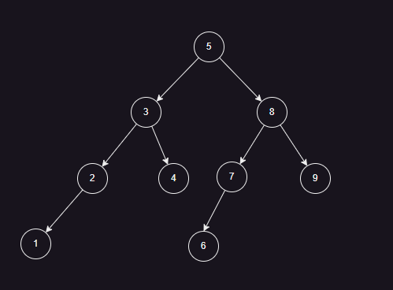

# 面向对象的概念及思维方式

我们先来看一个`树排序`的示例，分别使用基础类型和面向对象的思维去实现，来感受一下其中的不同。

> [!TIP]
> 树排序，指的是将原数组按照规则组合成二叉树，即左子树小于父结点，右子树大于父结点。然后以二叉树的中序遍历顺序，输出排序后的数组。

## 使用基础类型(数组)等来实现

如果我们只能使用基础类型来表示树型结构，我们就要了解其中的关系，也就是使用数组的索引关系来表示二叉树的结构。

如果我们认为父节点索引为0，那么左子树节点索引为1，右子树节点索引为2，即：

当父节点索引为`i`时，左子树节点索引为`2 * i + 1`，右子树节点索引为`2 * i + 2`。

如果我们认为父节点索引为1，那么左子树节点索引为2，右子树节点索引为3，即：

当父节点索引为`i`时，左子树节点索引为`2 * i`，右子树节点索引为`2 * i + 1`。



```csharp
int[] unsortedArray = [5, 3, 8, 4, 2, 7, 9, 1, 6];
Console.WriteLine("原数组: " + string.Join(", ", unsortedArray));
TreeSort(unsortedArray);
Console.WriteLine("排序后: " + string.Join(", ", unsortedArray));

static void TreeSort(int[] array)
{
    int n = array.Length;
    int[] tree = new int[2 * n];

    // 初始化树，所有节点的值为int.MinValue，表示为空，否则默认为0，会影响排序结果
    for (int i = 0; i < 2 * n; i++)
    {
        tree[i] = int.MinValue;
    }

    // 将数组元素插入到二叉搜索树中
    for (int i = 0; i < n; i++)
    {
        InsertIntoBST(tree, array[i], 0);
    }

    // 从根节点开始遍历二叉搜索树，将元素按中序遍历的顺序放回到数组中
    int index = 0;
    InOrderTraversal(tree, 0, array, ref index);
}

// 将value从nodeIndex开始插入到tree中
static void InsertIntoBST(int[] tree, int value, int nodeIndex)
{
    // 节点未使用时，直接插入
    if (tree[nodeIndex] == int.MinValue)
    {
        tree[nodeIndex] = value;
    }
    // 小的插入左边
    else if (value < tree[nodeIndex])
    {
        InsertIntoBST(tree, value, 2 * nodeIndex + 1);
    }
    // 大的插入右边
    else
    {
        InsertIntoBST(tree, value, 2 * nodeIndex + 2);
    }
}

// 从tree中nodeIndex开始搜索，找到较小值，然后依次放入array中
static void InOrderTraversal(int[] tree, int nodeIndex, int[] array, ref int index)
{
    if (nodeIndex >= tree.Length || tree[nodeIndex] == int.MinValue)
    {
        // 超出树的范围或者节点为空时返回
        return;
    }
    // 递归遍历左子树
    InOrderTraversal(tree, 2 * nodeIndex + 1, array, ref index);
    // 找到最小值后赋值
    array[index++] = tree[nodeIndex];
    // 递归遍历右子树
    InOrderTraversal(tree, 2 * nodeIndex + 2, array, ref index);
}
```

## 使用自定义类型(树结构)实现

```csharp

int[] unsortedArray = [5, 3, 8, 4, 2, 7, 9, 1, 6];
int[] sortedArray = TreeSort(unsortedArray);
Console.WriteLine("原数组: " + string.Join(", ", unsortedArray));
Console.WriteLine("排序后: " + string.Join(", ", sortedArray));

static int[] TreeSort(int[] array)
{
    // 默认根节点为空
    TreeNode? root = null;
    // 构建二叉搜索树
    foreach (int value in array)
    {
        root = Insert(root, value);
    }

    // 中序遍历二叉搜索树并获取排序后的元素
    List<int> sortedList = [];
    InOrderTraversal(root, sortedList);
    return sortedList.ToArray();
}


// 从节点node开始，插入值value
static TreeNode Insert(TreeNode? node, int value)
{
    // 节点为空时，插入新节点
    if (node == null)
        return new TreeNode(value);

    // 小于当前节点值时，插入左子树
    if (value < node.Value)
    {
        node.Left = Insert(node.Left, value);
    }
    // 大于等于当前节点值时，插入右子树
    else
    {
        node.Right = Insert(node.Right, value);
    }
    return node;
}

// 搜索node节点下最小值
static void InOrderTraversal(TreeNode? node, List<int> result)
{
    if (node == null)
        return;

    // 遍历搜索左子树
    InOrderTraversal(node.Left, result);
    result.Add(node.Value);
    // 遍历搜索右子树
    InOrderTraversal(node.Right, result);
}

// 定义树型结构
public class TreeNode(int value)
{
    public int Value = value;
    // 左子树
    public TreeNode? Left = null;
    // 右子树
    public TreeNode? Right = null;
}
```

从上面的示例可以看出，使用面向对象的思维方式，我们可以更加直观的表达事物之间的关系，更加容易理解和维护。

对于二叉树，我们可以简单的通过类来定义出来，包括它的左右子树的关系。如果仅使用基础类型，如数组，则要通过节点的索引关系来表示树结构。

## 面向功能需求

当然，在实际编程中，对于排序这种常见的需求，我们当然不需要自己去实现，很多类库在内部已经实现了这些功能。

而且由于在不同数据分布情况下，不同算法性能也不同，对于常见的排序功能，如果每次都要自己编写很多种排序算法，然后结合起来使用，那将太可怕了。

所以，如果是面向实际业务，我们的代码应该是这样的：

```csharp
int[] unsortedArray = [5, 3, 8, 4, 2, 7, 9, 1, 6 ];
// 使用 SortedSet 插入元素并自动排序
var sortedSet = new SortedSet<int>(unsortedArray);
Console.WriteLine("排序后:" + string.Join(",", sortedSet.ToArray()));
```

或者直接使用Linq的OrderBy方法：

```csharp
int[] unsortedArray = [5, 3, 8, 4, 2, 7, 9, 1, 6 ];
var sortedArray = unsortedArray.OrderBy(x => x).ToArray();
Console.WriteLine("排序后:" + string.Join(",", sortedArray));
```

以上代码，我们使用了`SortedSet`类和`IEnumerable`接口的`OrderBy`方法，这是.NET SDK本就提供的。

正是因为有了面向对象的思维，.NET SDK可以将各种常见的功能封装成类，提供很多方便的方法，我们只需要调用即可，而不需要自己去实现。

如果不使用面向对象的思维，我们就需要记住大量的可能难以记忆的函数方法以及其参数含义，这将是一件非常痛苦的事情。

## 面向对象概念

面向对象一句话概括就是：编程语言使用类的方式来抽象和表达事物。

那么类有什么神奇的地方，能够抽象万物呢？

我们先来模拟一下人类是如何抽象和定义事物的：

- 定义动物是什么： 有生命，有感觉，有呼吸，有繁殖能力
- 定义狗是什么： 有生命，有感觉，有呼吸，有繁殖能力，有四条腿，有尾巴，有毛发
- 定义什么是汽车： 有四个轮子，有发动机，有车门，有车窗
- 定义香蕉： 形状，颜色，味道

将事物具有什么样的属性，有什么样的行为抽象出来，就能形成类的定义，而这种抽象的方式，就是面向对象的思维方式。

在了这种思维，再结合在软件工程方面的实践经验，编程语言还引入了`接口`，`继承`，`多态`等概念，使得类的定义和使用更加灵活和强大。

关于面向对象的概念，我们会在后续教程中直接从代码中去学习和使用，这样会更加直观和容易理解。
