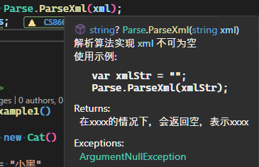

# C#中的注释

## 基本注释

通常编程语言都支持对代码进行单选或多行注释，如

```csharp
// 代码注释
public static void CodeComment()
{
    var a = 1; // 单选注释
    /* 
     * 多行注释
     * var b = 2;
     * var c = 3;
     */

    //var b = 2;
    //var c = 3;
}
```

## XML文档注释

XML文档注释是一种特殊的注释，它以`///`开头，通常用于对`类、接口、方法、属性`等代码元素进行注释。`xml`提供了一种更加丰富的语法表达，利用它，我们可以实现很多其他的功能，来提升开发体验。

如，我们定义一个方法，并添加上注释:

```csharp
/// <summary>
/// 解析算法实现
/// <paramref name="xml"/> 不可为空
/// <br/>
/// <example>
///    使用示例:
/// <code>
///    var xmlStr = "";
///    Parse.ParseXml(xmlStr);
/// </code>
/// </example>
/// </summary>
/// 
/// <param name="xml" > 不可为空的xml格式字符串</param>
/// <returns>在xxxx的情况下，会返回空，表示xxxx</returns>
/// <example> parseXml("content")</example>
/// <exception cref="ArgumentNullException">xml为空字符串时</exception>
public static string? ParseXml(string xml)
{
    // TODO：具体实现
    if (string.IsNullOrWhiteSpace(xml))
    {
        throw new ArgumentNullException(nameof(xml), "空字符串");
    }
    return xml;
}
```

当我们调用该方法时，我们将获取丰富的提示信息，如：



### 注释跳转

在注释中，我们可以使用`<see cref=""/>`标签来实现跳转，如：

```csharp
/// <summary>
/// 解析
/// </summary>
/// <param name="xml"></param>
/// <see cref="Parse.ParseXml(string)" href="http://blog.dusi.dev"/>
/// <returns></returns>
public string Example(string xml)
{
    // TODO:预处理
    var res = Parse.ParseXml(xml);
    return res;
}
```

在我们使用该方法时，可以跳转到其他关联的方法，这样可以方便我们查看相关的代码。或者使用`href`属性来指定跳转的链接，比如更加详细的说明文档。

可以在`DTO`类中添加对原始类型的引用，方便对比查看。

### 注释继承

在`C#`中，我们可以使用`<inheritdoc/>`标签来继承父类的注释，如：

```csharp
public interface IAnimal
{
    /// <summary>
    /// 发声
    /// </summary>
    /// <param name="content"></param>
    void Speak(string content);
}
public class Animal : IAnimal
{
    public required string Name { get; set; }

    /// <summary>
    /// 动物叫
    /// </summary>
    /// <param name="content"></param>
    public virtual void Speak(string content)
    {
        Console.WriteLine("发音:" + content);
    }
}

public class Cat : Animal
{
    /// <inheritdoc cref="IAnimal.Speak"/>
    public override void Speak(string content)
    {
        base.Speak("猫叫:" + content);
    }
}
```

## 生成文档

我们演示了几种最常见的注释的使用方法和场景，更多更详细的用法，请查看[官方文档](https://learn.microsoft.com/zh-cn/dotnet/csharp/language-reference/xmldoc/recommended-tags).

通常对于一个项目，注释的行数占比是很大的，甚至是超过代码的行数，但这些注释对于代码运行没有任何作用，在程序编译时，去移除这些注释，能显著减少程序体积。

.NET提供了一种方式将所有的`xml注释`生成一个文件，以便提供给其他工具使用。

### 生成文档文件

在项目配置中，找到构建中的输出选择，选择生成`XML文档文件`，或者直接在`.csproj`中添加

```xml
<PropertyGroup>
    <!-- ... -->
    <GenerateDocumentationFile>True</GenerateDocumentationFile>
</PropertyGroup>
```

这样在构建时，我们就会看到生成的`xml`文件了，那么其他的工具就可以使用这个文件来进一步生成文档了。

### 使用DoxFX生成文档

想必大家都看过微软的官方文档，.NET SDK为开发者提供了丰富的功能，我们除了使用IDE的提示来了解相关类的使用

生成Swagger
